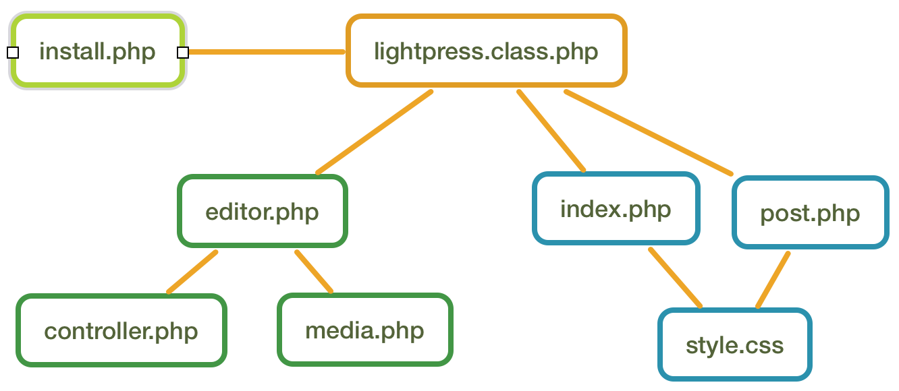
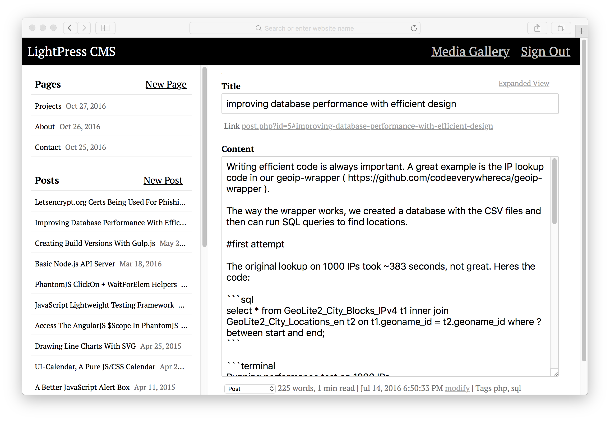
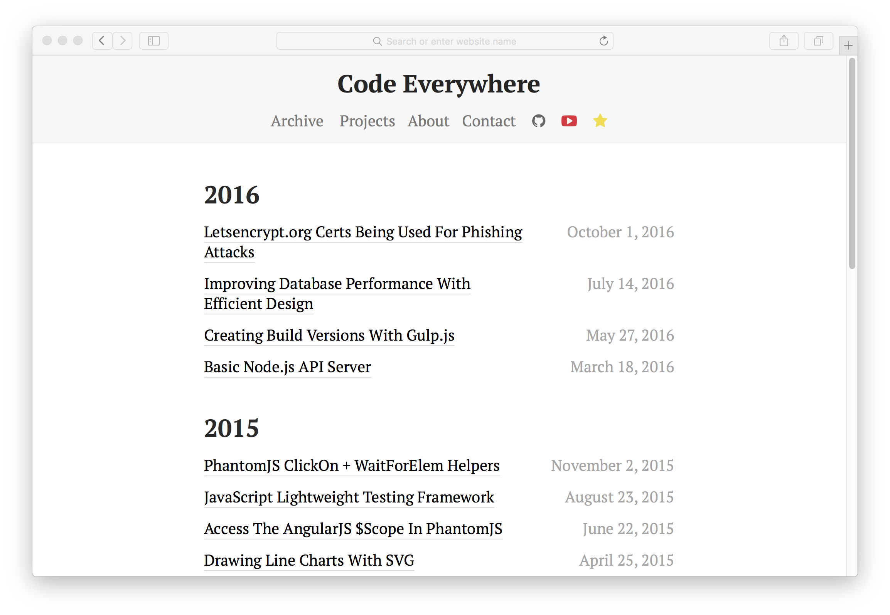
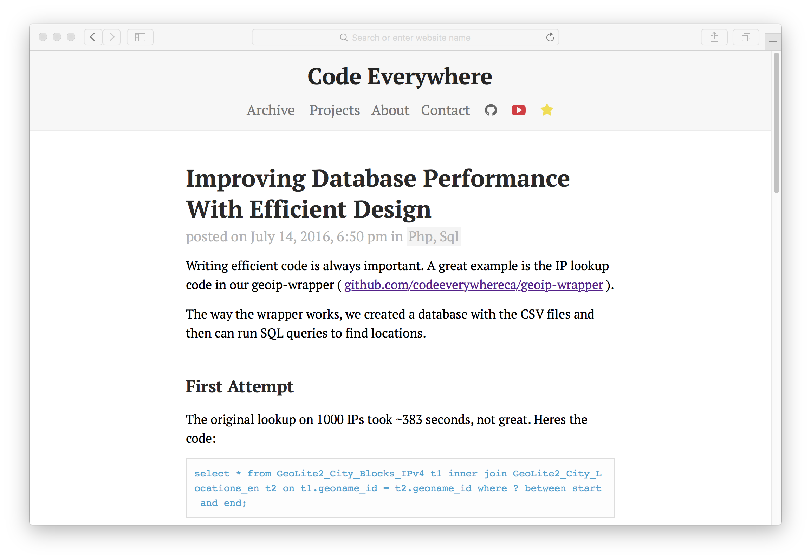

# LightPress CMS (v1.0)
A lightweight blog engine, written in AngularJS, PHP and SQLite.

Why use it?
- Write posts in **Markdown**
- Category support with **tags**
- Small code base
- Easy to customize
- Built-in code block functionality

## Overview


## Install
To install, create a new file, call it **install.php**. Add in the following code and run:
```php
<?php
  mkdir('uploads');
  require('lightpress.class.php');
  $lp = new lightpress();
  $lp->build();
?>
```
Once done, delete the **install.php** file, navigate to /editor.php and use password **admin1**. The password can be changed in **lightpress.class.php** line 16.

## Usage
To add heading use #heading

To add bold text use \*\*some text**

To add images use \[image:uploads/image-link.jpg] (built-in image uploader)

To add tags use [tags:aaa, bbb, ccc]

To add a code block use \`\`\`( php | sql | js-inc | css-inc | html | js | css | terminal ) ... \`\`\`

Special note, 'js-inc' and 'css-inc' will include the code on your page.

To add a quote use \`\`\`quote ... \`\`\`

To add a table use \`\`\`table ... \`\`\`

To add a skip block use \`\`\`skip ... \`\`\`

## Code Block Table Example
```html
```table
a|b|c
d|e|f
...
```

## Screenshots (Example Website)
Editor


Archive


Post

